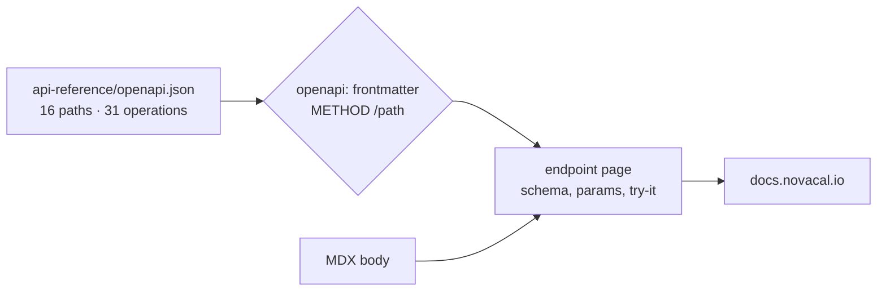

<picture>
  <source media="(prefers-color-scheme: dark)" srcset="https://shieldcn.dev/header/graph.svg?title=Novacal+Docs&subtitle=API+reference+for+the+Novacal+scheduling+API&align=left&mode=dark" />
  
</picture>

[](https://docs.novacal.io)
[](api-reference/openapi.json)
[](#the-openapi-spec)
[](LICENSE)

The content source for **[docs.novacal.io](https://docs.novacal.io)** — the developer documentation for the [Novacal](https://novacal.io) public API.

This repository holds no product code and has no build step. Every page is an MDX file, and [Mintlify](https://mintlify.com/docs) turns the folder into a hosted site on every push to `main`.

> Looking for the end-user help centre instead? That lives at [help.novacal.io](https://help.novacal.io), in a separate repo.

---

## Who this is for

| You are | Start here |
| --- | --- |
| Integrating against the Novacal API | [docs.novacal.io](https://docs.novacal.io) — this repo is just the raw source |
| Documenting a new or changed endpoint | [Adding an endpoint page](#adding-an-endpoint-page) |
| Fixing prose on an existing page | [Editing a page](#editing-a-page) |
| Changing structure, theme, or SEO | [docs.json](docs.json) — see [Configuration](#configuration) |

---

## Quick start

Mintlify's CLI is the only dependency. There is no `package.json` here — install it globally.

```bash
npm i -g mint     # install the CLI
mint dev          # run from the repo root, where docs.json lives
```

Open <http://localhost:3000>. The preview hot-reloads as you save.

```bash
mint update            # upgrade the CLI when dev won't start
mint broken-links      # check every internal link before you push
mint a11y              # check pages for accessibility issues
mint rename old new    # rename a page and rewrite every link to it
```

---

## The OpenAPI spec

This is the part that makes this repo different from a normal docs site. The request/response tables, parameter lists, and "Try it" panels are **not written by hand** — they are generated from [api-reference/openapi.json](api-reference/openapi.json).

| | |
| --- | --- |
| Spec version | OpenAPI **3.1.0** |
| API title | Events API `1.0.0` |
| Server | `https://api.novacal.io` |
| Auth | `bearerAuth` — HTTP bearer, applied globally |
| Paths | 16 |
| Operations | 31 |

An endpoint page binds itself to one operation with the `openapi` frontmatter key. From `api-reference/v1/events/create.mdx`:

```mdx
---
title: "Book Event"
"og:title": "Book Event - Novacal API Documentation"
"twitter:title": "Book Event - Novacal API Documentation"
description: "Book a new Novacal event with the public API by sending the event type, selected time, attendee answers, timezone, and location data."
openapi: "POST /v1/events"
---

This endpoint requires a public API bearer token.
```



So each page is two halves: the generated reference, and the hand-written MDX body underneath it explaining when to use the endpoint and how auth behaves. **Changing a schema means editing the spec, not the page.**

---

## How the docs are organised

Navigation is nine groups, all under `api-reference/`:

| Group | Pages | Covers |
| --- | --- | --- |
| API Reference | 3 | Introduction, MCP, Errors |
| Event Types | 5 | get, create, update, delete, find |
| Booking Forms | 5 | get, create, update, delete, update-order |
| Events | 5 | get, create, find, update, cancel |
| Webhooks | 5 | get, create, find, update, delete |
| Contacts | 5 | get, create, find, update, delete |
| Teams | 2 | get, find |
| Users | 2 | me, update-me |
| Availability | 1 | get |
| **Total** | **33** | |

The repo holds 49 `.mdx` files, so 16 are not published. See [Known cleanup](#known-cleanup).

Supporting files:

```txt
docs.json                    Navigation, theme, SEO metadata, analytics script
api-reference/openapi.json   The spec every endpoint page renders from
custom.css                   Custom styling
ahrefs-analytics.js          Ahrefs tracking, loaded via docs.json scripts
images/                      Screenshots, referenced as /images/*.png
logo/                        light.svg and dark.svg wordmarks
```

---

## Editing a page

Every page opens with frontmatter. Match the house style:

- **`title`** sets both the sidebar label and the page H1. Never write your own `#` heading — the body starts at `##`.
- **`description`** is the meta description. One sentence describing what the endpoint does and what it takes.
- **`og:title` and `twitter:title`** end with `- Novacal API Documentation`.
- **`openapi`** binds the page to a spec operation. Endpoint pages only.

The body convention on endpoint pages is consistent and worth keeping: a one-line auth statement, then `## When to use this endpoint` with a short bulleted list of use cases, then `## Authentication notes`.

---

## Adding an endpoint page

1. **Add the operation to [api-reference/openapi.json](api-reference/openapi.json) first.** Without it, the `openapi` key resolves to nothing and the page renders with no reference block.
2. Create the `.mdx` file under `api-reference/v1/<resource>/<action>.mdx`.
3. Set `openapi: "METHOD /path"` to exactly match the spec, including `{id}`-style placeholders.
4. Add the page path — no extension — to the right group in `docs.json`:

```json
{
  "group": "Events",
  "pages": [
    "api-reference/v1/events/get",
    "api-reference/v1/events/create",
    "api-reference/v1/events/find",
    "api-reference/v1/events/update",
    "api-reference/v1/events/cancel"
  ]
}
```

5. Run `mint dev` and confirm the reference block actually rendered. A typo in the `openapi` value fails silently — you get the prose with no schema under it.

---

## Configuration

Everything site-wide lives in [docs.json](docs.json).

| Key | What it controls |
| --- | --- |
| `navigation.groups` | Sidebar structure. A page not listed here is not published. |
| `colors` | Brand green — `#16A34A` primary, `#07C983` light, `#15803D` dark. |
| `appearance` | `default: "dark"`. No `strict` flag, so readers can toggle to light. |
| `contextual.options` | The per-page AI actions: copy, view, ChatGPT, Claude, Perplexity, MCP, Cursor, VS Code. |
| `seo.metatags` | Site-wide Open Graph, Twitter Card, and robots tags. Page frontmatter overrides these. |
| `scripts` | Loads [ahrefs-analytics.js](ahrefs-analytics.js). |
| `navbar` | The Support mail link and the Dashboard button. |

---

## Publishing

Push to `main` and the [Mintlify GitHub app](https://dashboard.mintlify.com/settings/organization/github-app) deploys to [docs.novacal.io](https://docs.novacal.io) automatically. There is no CI in this repo and no manual build — `mint dev` locally is the only check before merge.

---

## Contributing

1. Branch off `main`.
2. If the change touches request or response shape, edit `openapi.json` first.
3. Write or edit the `.mdx` file, matching the frontmatter pattern above.
4. Add the page to `docs.json` if it is new.
5. Run `mint dev` and read the page in the browser — confirm the generated reference block is there, not just your prose.
6. Run `mint broken-links`.
7. Open a PR. Merging to `main` publishes it.

**House style:** short sentences, second person, present tense. Describe what the endpoint does and what the caller must send, not what the reader might be building.

---

## Known cleanup

Sixteen `.mdx` files are not in the navigation. Most are deliberate, but four are worth a decision:

- **`api-reference/v1/events/delete.mdx` is stale.** It declares `openapi: "DELETE /v1/events/{id}"`, and that operation does not exist in the spec — cancelling is `PUT /v1/events/{id}/cancel`. Publishing this page as-is would render prose with no reference block.
- **`api-reference/v1/teams/delete.mdx` and `teams/update.mdx` have no `openapi` key**, and the spec has no matching operations. They are drafts for endpoints the API does not expose yet.
- **`api-reference/v1/teams/create.mdx` is publishable.** It declares `POST /v1/teams`, which *is* in the spec. Adding one line to `docs.json` would ship it.
- **`ai-tools/` (3 pages)** — Claude Code, Cursor, and Windsurf guides, written but never linked into the nav.
- **`essentials/` (6 pages) and `snippets/`** are unmodified Mintlify starter-kit content, useful only as syntax reference.
- **`index.mdx` and `development.mdx`** are not in any nav group. `index.mdx` still serves as the landing page at `/`.
- **`custom.css` is registered three times** in `docs.json` — as `stylesheet`, `styles.css`, and `styling.customCss`. Only the last is current; the other two are legacy keys.
- **[LICENSE](LICENSE) still reads `Copyright (c) 2023 Mintlify`**, inherited from the starter template. If the documentation content is meant to be Novacal's, update the copyright line.

---

## Maintainer

Written and maintained by **Stefan Babic** ([@ste7](https://github.com/ste7)) — 51 commits since January 2026.

Questions about the product go to [support@novacal.io](mailto:support@novacal.io). Product updates are posted on [LinkedIn](https://linkedin.com/company/novacal-io) and [X](https://x.com/novacalio).

---

## Links

- **API docs** — <https://docs.novacal.io>
- **Help centre** — <https://help.novacal.io>
- **Product** — <https://novacal.io>
- **Dashboard** — <https://app.novacal.io>
- **Support** — <support@novacal.io>

## License

[MIT](LICENSE).
